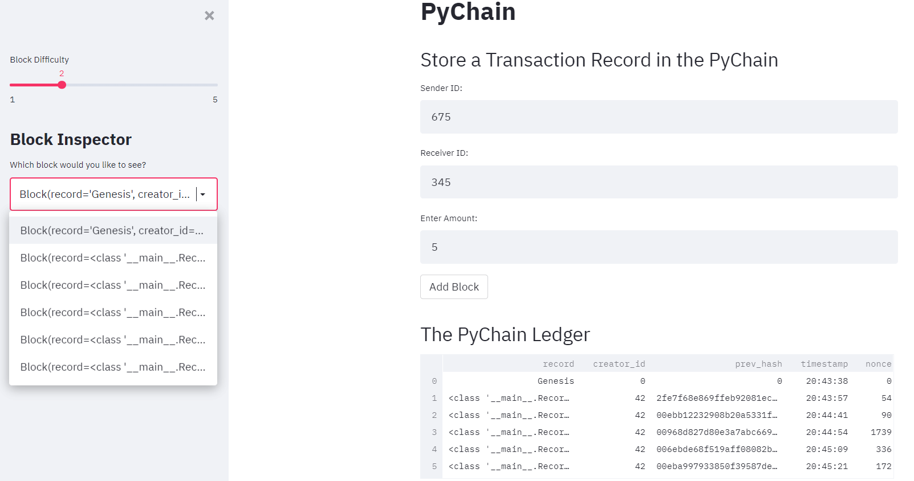
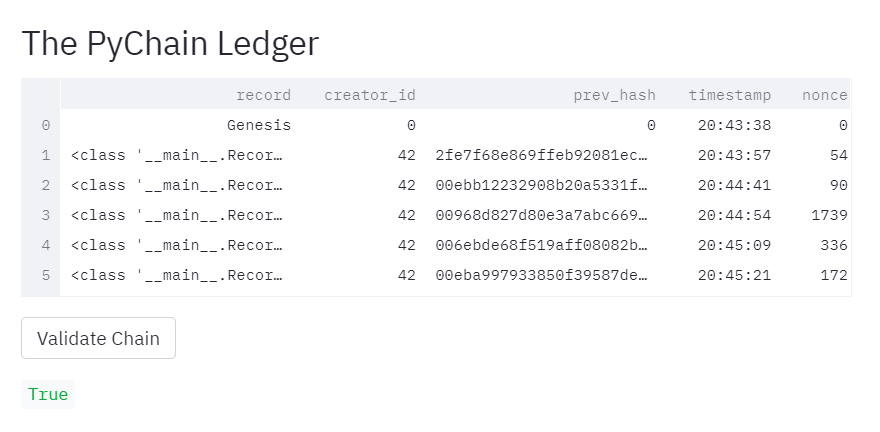

# Module 18 Challenge

---

## Blockchain-Based Ledger System with Web Interface

This is a blockchain-based ledger system with a web interface that allows partner banks to transfer funds.  The integrity of the data is verified in the ledger.  

As shown in the visual below, the user will input sender and receiver information along with the amount to be transfered.  The transactions are logged once the "Add Block" button is clicked.  

Once the transactions are logged, the validity of the blockchain can be verified, as shown below:

---

## Technologies

This application and web interface utilizes the following technologies:

* Streamlit - To create the web application (https://streamlit.io/) version 0.84.2 must be used

* Pandas - To create and run the program (https://pandas.pydata.org/)

* Dataclass - Tool to make structured classes for storing data (https://realpython.com/python-data-classes/)

* Typing - Provides runtime support for type hints (https://docs.python.org/3/library/typing.html)

* Datetime - To standardize date formats (https://docs.python.org/3/library/datetime.html)

* Hashlib - To convert variable length of bytes to fixed length sequence (https://docs.python.org/3/library/hashlib.html)

---

## Installation Guide

import streamlit as st
from dataclasses import dataclass
from typing import Any, List
import datetime as datetime
import pandas as pd
import hashlib

---

## Usage

To run this application, copy the repository and navigate to your designated folder.  Open the folder on the terminal and input 'streamlit run pychain.py'.  The web interface will then open and inputs can be entered into the fields.

---

##  Contributors

ABolla, Lead Developer

---

##  License

MIT